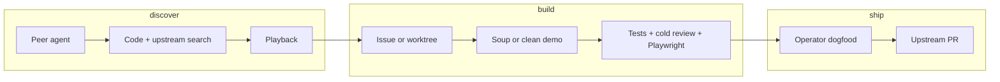

# AGENTS.md

> Before proceeding, read `~/coding/AGENTS.local.md` and `~/coding/SOUL.md` when present
> (or repo-local copies). They define local operator voice. Never commit or cite them.

---

## Progress Reporting

Each update is one line:

```
<STATE> | <DELTA> | <NEXT> | <ASK>
```

**STATE:** `moving` · `blocked` · `done`
**DELTA:** What changed. New only. No history.
**NEXT:** What happens next without operator input.
**ASK:** Required operator action, or `none`.

Rules:
- One line. No logs, no reasoning.
- `moving` → ASK is `none`
- `blocked` → ASK is concrete and actionable
- No meaningful change twice in a row → STATE becomes `blocked`

```
moving | tests added | running CI | none
blocked | missing env var | waiting | add STRIPE_KEY
done | deployed to prod | monitoring | none
```

---

## Decision Contract

**Ambiguity** — Ask before acting. One focused question, not a list.
**Done** — Tests pass. Fix **deployed** to the environment the operator cares about (usually production). Commit when the repo uses git-triggered deploy; otherwise use the project's documented deploy command. Operator unblocked.
**Scope** — Do exactly what was asked. Flag additions as options; don't implement them.
**Blockers** — Surface immediately. Never work around a blocker silently.

---

## Ship After Fix (mandatory)

Saving files locally is not shipping.

When you change application code in a repo with a known deploy path (Vercel, Fly, Docker prod, etc.):

1. **Deploy** after the fix using that project's documented prod command (e.g. `npx vercel deploy --prod --scope <team>`). Do not wait for the operator to ask.
2. **Do not** treat "I'll deploy when you push" as done unless deploy is impossible (missing credentials, hook failure, operator said local-only).
3. If deploy fails, state **blocked** with the error; do not claim the fix is live.
4. **Preview-only** changes: deploy preview/staging when documented; prod only when the fix targets prod UX or config.

Exception: docs-only or `.md` with no runtime effect — deploy optional unless the operator expects it live.

**HAPI new functionality** — "deployed" means the **demo environment** (soup or clean instance) is live and passed pre-operator gates (§6 below). Upstream PR and daily-driver manifest are **later** steps after operator dogfood approval. See [New functionality intake](#new-functionality-intake).

---

## Communication

No narration. No recaps. No "here's what I did."
Report results, not activity. If nothing changed, say so.

**GitHub issues and PRs** — When you mention an issue or pull request number, it must be a markdown link, not bare `#NNN`. Use the canonical URL on the repo you mean (upstream HAPI: `https://github.com/tiann/hapi/issues/737`, `https://github.com/tiann/hapi/pull/567`). Example: [issue #737](https://github.com/tiann/hapi/issues/737).

**New product features (web/hub/cli)** — Follow [New functionality intake](#new-functionality-intake) (mandatory). Worktree discipline and soup mechanics: `AGENTS.local.md` (never upstream) + [`docs/tooling/new-feature-intake.md`](docs/tooling/new-feature-intake.md).

---

## New functionality intake

When the operator asks for **new behavior**, follow this pipeline. Do not skip to implementation or "please test in your browser."

### Roles

| Role | Owns |
|------|------|
| **Orchestrator** | Peer handoff, discovery (§1-3), issue filing, soup vs clean choice, manifest / Proxmox demo |
| **Feature peer** | Worktree implementation, §6 gates, iteration until operator handoff |
| **After operator OK** | Upstream PR + review threads (§8) |

### Pipeline

| Step | Gate |
|------|------|
| **0** | Spawn a **feature peer agent** linked to the parent session (id + request + issue link when exists). |
| **1** | **Code search** — prove the behavior does not already exist (cite paths). |
| **2** | **Upstream search** — `tiann/hapi` issues and PRs, **open and closed**. |
| **3** | **Playback** — summarize problem, gap, and scope; wait for operator confirmation. |
| **4** | Operator: **open issue** (you create it) or **worktree spike** without issue. |
| **5** | If implementing: operator chooses **soup** (manifest + `:3006`) or **clean instance** (Proxmox / LAN, `upstream/main` only, **new port**; do not swing `hapi-active`). Add **runner** only if remote spawn is required. |
| **6** | **Before operator test:** `bun typecheck` + `bun run test` → **cold code review** ([rubric](docs/tooling/cold-pr-review-rubric.md)) → **Playwright smoke** (`scripts/dev/read-hapi-web.mjs`; `PLAYWRIGHT_CHROME_PATH=/usr/bin/google-chrome` on Linux). Fix failures; do not hand off early. |
| **7** | Operator **dogfoods** via tailnet + LAN links (deep route when possible). |
| **8** | **After explicit approval:** verification + cold review on PR diff → `gh pr create` vs `upstream/main` → link issue. |

Full detail, Proxmox notes, and diagram: [`docs/tooling/new-feature-intake.md`](docs/tooling/new-feature-intake.md).



**Never** ask the operator to browser-test until §6 passes. **Never** open an upstream PR until §7 approves.

---

## CursorVox cockpit (visual review)

For **CursorVox** UI judgments ("go look at the interface"), use the mobile screenshot harness and vision on the PNGs. See **`~/coding/cursorvox/AGENTS.md`** (Visual review section): `cd ~/coding/cursorvox/frontend && npm run capture-ui`, then read `screenshots/mobile-cockpit/*.png`.
