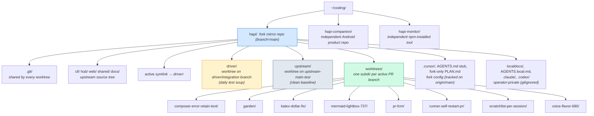
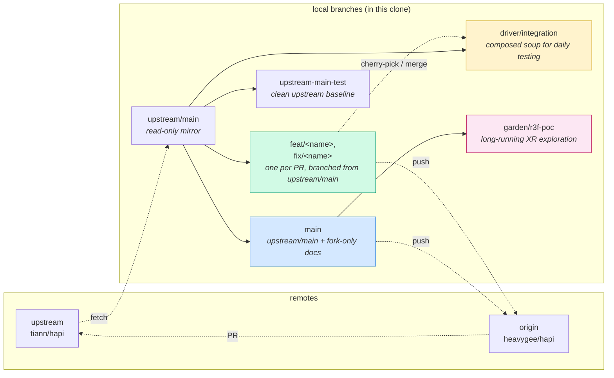
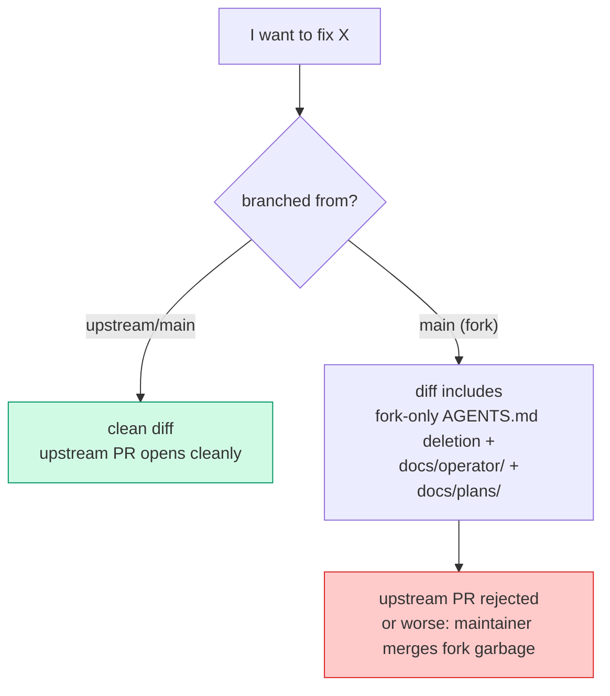
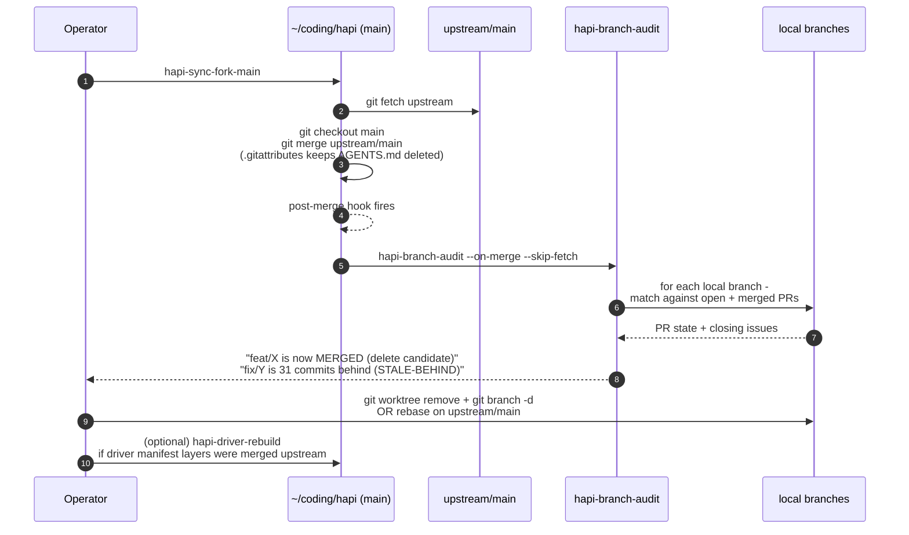
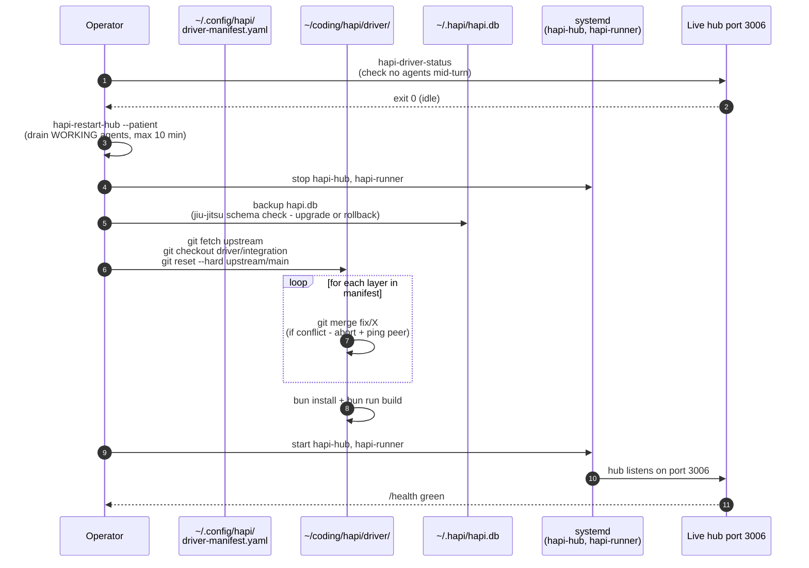
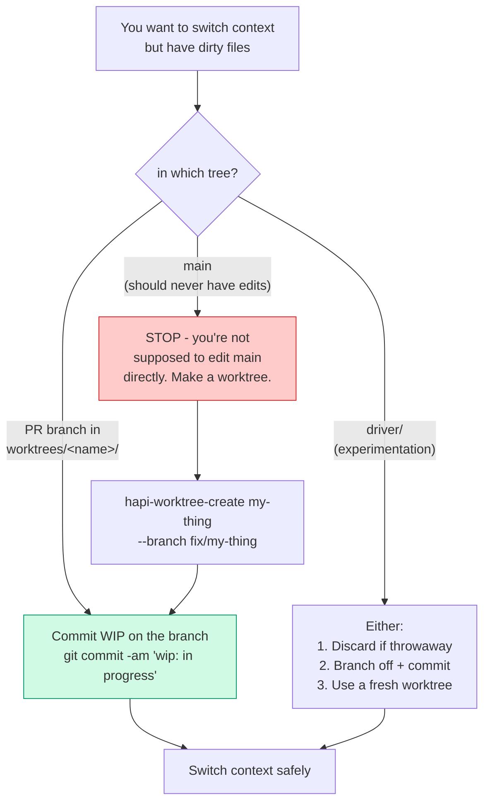

# Repo layout and dev flow (fork operator's reference)

A single overview of how a long-lived fork of `tiann/hapi` is organized for parallel speculative work, daily testing across multiple in-flight features, and clean upstream contribution.

Audience: the operator of this fork, peer agents working in it, and anyone evaluating this pattern for their own fork-with-speculative-work setup. Use as the entry point; dive into the subordinate docs from the cross-references at the end.

All paths use `~` (the operator's home directory). On this machine that resolves to `/home/heavygee`, but nothing here depends on that.

---

## TL;DR — three things to know

1. **`~/coding/hapi/` is the fork repo itself.** Worktrees, driver, and upstream-baseline live INSIDE it under `worktrees/`, `driver/`, `upstream/`. It is not a container holding the repo as a subfolder.
2. **One branch per upstream-tracked item** (issue / PR / discussion). `hapi-branch-audit` enforces this read-only; `hapi-pr-create` enforces it at PR-open time.
3. **No stashes.** Each context has its own worktree, so the "I need to stash to switch" need disappears. If you find yourself reaching for `git stash`, the right answer is a WIP commit on the current branch or a new worktree.

---

## 1. The layout



### What each entry is

| Entry | Purpose | Tracked on origin/main? |
|-------|---------|------------------------|
| `~/coding/hapi/` (top level) | The fork repo. Same `.git` dir backs every worktree below. | n/a |
| `cli/ hub/ web/ shared/ docs/` | Upstream source. Edited via PR branches in `worktrees/`. | yes (upstream) |
| `active` | Symlink to `driver/`. Systemd reads from `active`. Decouples "what's running" from "which branch is the active soup". | tracked (gitignored target) |
| `driver/` | Worktree on `driver/integration`. The composed soup of multiple in-flight PR branches the operator daily-drives. | tracked (gitignored target) |
| `upstream/` | Worktree on `upstream-main-test`. Clean upstream baseline for A/B comparisons. | tracked (gitignored target) |
| `worktrees/<name>/` | One subdir per active PR branch. Each branched off `upstream/main`. Each has its own working tree, dirty state, dev server port. | tracked (gitignored target) |
| `.cursor/`, `AGENTS.md` (stub), `PLAN.md` | Fork-only config: cursor rules, integration plan pointer. **`origin/main`** for non-operator rules; operator-fork rule included. Never to `upstream`. | yes (fork-private upstream) |
| `docs/operator/`, `docs/tooling/` | Fork operator canon + tooling docs. **`origin/main`** on GitHub. Never to `upstream`. | yes (fork-private upstream) |
| `docs/plans/` | Peer briefings, integration depth, postmortems. **Mirror only** — pre-push blocks new/changed plans to public `origin`. | yes (local-first) |
| `localdocs/`, `AGENTS.local.md`, `.claude/`, `.codex/` | Operator-private artifacts (HAR captures, Playwright runs, machine-specific rules). Untracked. | no — gitignored |

**Sibling repos at `~/coding/` (NOT under `hapi/`):**

- `~/coding/hapi-companion/` — separate Android product repo (`heavygee/hapi-companion.git`)
- `~/coding/hapi-monitor/` — separate npm-installed monitoring tool

These stay independent because they're independent products. The "everything under one umbrella" temptation was considered and rejected — see `docs/plans/2026-06-01-hapi-folders-reorganization.md` §2 constraint: `~/coding/hapi/` IS the canonical fork mirror checkout; making it a pure container would require moving `.git`, which invalidates every worktree's anchor pointer.

---

## 2. The branches



### Branch purposes and lifetime

| Branch | Base | Purpose | Lifetime | PR'd upstream? |
|--------|------|---------|----------|----------------|
| `main` (fork) | `upstream/main` + fork-only commits | Local dev landing; receives upstream syncs; carries operator docs | permanent; never PR'd | **NO** |
| `driver/integration` | `upstream/main` + selective merges of in-flight feature branches | Daily test "soup" composed via `~/.config/hapi/driver-manifest.yaml`; what `hapi-runner` actually executes | permanent; rebuilt nightly or on demand | **NO** |
| `upstream-main-test` | `upstream/main` | Clean baseline for A/B comparison against driver behavior | permanent | **NO** |
| `garden/r3f-poc` | `main` (fork) | Long-running speculative XR work; operator-owned spike | indefinite | **NO** |
| `feat/<x>`, `fix/<x>` | `upstream/main` (always — never `main`, never `driver/integration`) | One per upstream issue / PR / discussion | dies when PR merges or is killed | **YES** |

### The two-branch trap (the most common mistake)



`hapi-pr-create` refuses PRs from infra branches (`main`, `driver/integration`, `upstream-main-test`, `garden/r3f-poc`) and refuses branches whose history includes all of `driver/integration`. The pre-push hook also scans the outgoing diff for fork-private paths.

---

## 3. Flow: new feature → upstream merge

The upstream PR is the **last** step, not the first. Every PR passes through a fork-side cold-review stage where the fork's own review bot critiques the diff. The operator iterates until the bot has no remaining findings, then promotes to upstream. The goal: **every upstream push is green on first review** — no public bot-feedback-then-fix cycle.

```mermaid
sequenceDiagram
    autonumber
    participant OP as Operator
    participant ORCH as Orchestrator agent
    participant PEER as Feature peer agent
    participant WT as Worktree<br/>(~/coding/hapi/worktrees/X/)
    participant FORK as origin (fork)
    participant BOT as Fork-side review bot
    participant US as upstream (tiann/hapi)

    OP->>ORCH: "I want feature X"
    ORCH->>US: search issues + PRs<br/>(open and closed)
    Note right of ORCH: skip if already filed
    ORCH->>US: file upstream issue #N<br/>OR keep as spike
    ORCH->>PEER: spawn with intake §0 handoff<br/>(parent session, DONE vs OWNED)
    PEER->>WT: hapi-worktree-create X --branch fix/X<br/>(off upstream/main)
    loop iterate
        PEER->>WT: edits, tests, commits<br/>(no stashes - WIP commit if interrupted)
    end
    PEER->>PEER: cold self-review + Playwright<br/>(per cold-pr-review-rubric.md)
    PEER->>OP: "ready for dogfood"
    OP->>WT: operator browser-tests in worktree<br/>(or via driver soup)
    OP->>PEER: dogfood approved

    rect rgb(255, 245, 220)
    Note right of PEER: FORK-SIDE COLD-REVIEW GATE<br/>(below this point happens on heavygee/hapi)
    PEER->>FORK: git push -u origin fix/X
    PEER->>FORK: open fork PR<br/>(base=main, draft, head=fix/X)
    FORK->>BOT: PR open event
    BOT-->>FORK: review comments + findings
    loop until clean
        PEER->>WT: address bot findings
        PEER->>FORK: git push (same branch)
        FORK->>BOT: push event
        BOT-->>FORK: re-review
    end
    OP->>FORK: apply 'cold-review-clean' label<br/>(operator says "I'm satisfied")
    PEER->>FORK: close fork PR<br/>(branch stays; PR was staging-only)
    end

    PEER->>US: hapi-pr-create<br/>--title T --body-file body.md
    Note right of PEER: wrapper enforces base upstream/main,<br/>leak scan, Closes #N keyword,<br/>AND a closed cold-review-clean fork PR exists
    US-->>US: upstream bot re-reviews<br/>(expect 1-3 NEW findings - same vendor,<br/>different stochastic pass, different RAG,<br/>integration collisions only visible upstream)
    loop iterate on upstream bot findings
        PEER->>WT: address upstream bot finding
        PEER->>US: git push (hapi-pr-reply on each thread)
        US-->>US: bot re-review
    end
    US->>US: maintainer merges PR
    OP->>FORK: hapi-sync-fork-main
    FORK->>FORK: post-merge hook runs<br/>hapi-branch-audit --on-merge
    FORK-->>OP: "fix/X is MERGED (delete candidate)"
    OP->>WT: git worktree remove X<br/>git branch -d fix/X
```

Key invariants of this flow:

- **The peer never works in `~/coding/hapi/driver/`** — that's the daily-driver tree. Each peer gets its own worktree under `worktrees/`.
- **Branched from `upstream/main`, never from `main`** — otherwise the PR diff includes fork-only commits.
- **One PR = one branch = one tracker** — every branch maps to one upstream issue/PR/discussion; audit flags violations.
- **Fork-side cold-review stage is non-optional** for non-trivial changes. The fork PR is opened against fork `main` as base (or `--draft`) purely to engage the review bot. The branch never gets merged into fork `main` — the fork PR is closed once the operator labels it `cold-review-clean`. Then the upstream PR is opened from the same branch.
- **`hapi-pr-create` is the upstream gate** — runs leak scan, requires `Closes #N`, AND refuses to open the upstream PR unless `hapi-pr-status` PASSes for the corresponding fork PR (i.e. either Codex commented clean OR the `cold-review-clean` label is applied). Bypass with `--skip-fork-stage` for trivial changes (typo fixes, doc-only, comment tweaks) where bot review adds nothing.
- **Bot/reviewer thread responses go via `hapi-pr-reply`, never `gh pr comment`** — on both fork and upstream PRs. The helper posts the reply AND calls `resolveReviewThread` atomically; `gh pr comment` on a PR with unresolved threads is hook-blocked (`permission: "deny"`). Same for `git push origin` when threads are unresolved. Full protocol: [`pr-review-loop.md`](../tooling/pr-review-loop.md) §"What to do with findings" and [`pr-reply.md`](../tooling/pr-reply.md).

### 3.1.5 Two clean-signals (auto-detected and operator override)

`hapi-pr-status` recognises two signals on a fork PR, either of which counts as "clean":

| Signal | Source | When it fires |
|--------|--------|---------------|
| Codex comment regex | `chatgpt-codex-connector[bot]` issue-comment matching `/Codex Review:.*Didn.t find any/` | Cloud auto-review found nothing actionable |
| `cold-review-clean` label | Operator-applied label on the PR | Operator override after addressing or accepting Codex findings (e.g. Codex flagged a P1 the operator decided to defer to a follow-up issue) |

The label always wins — useful when Codex flags something you've already addressed in a separate commit and don't want to wait for re-review.

Upstream `tiann/hapi` uses a different Codex surface (the openai/codex-action GHA workflow at `.github/workflows/codex-pr-review.yml`), which posts as formal `github-actions[bot]` reviews with a different clean regex. `hapi-pr-status` auto-detects which surface to check based on the repo owner — no flag needed.

### 3.1 Why the fork stage comes first

Two reasons:

1. **Public-facing PRs are reputational.** Bot feedback on an upstream PR is visible to the maintainer and anyone watching the repo. A "merge this in your sleep" PR followed by a flurry of bot-suggested commits looks like the author didn't self-review. The fork stage absorbs that round so the upstream PR looks first-try-clean.
2. **Bot reviewers are cheap; maintainer attention is not.** The fork bot finds the things a human reviewer would otherwise have to flag. Spending bot rounds on the fork preserves maintainer attention for the things only a human can judge (API design, breaking-change risk, idiomatic fit).

The fork PR is **staging infrastructure**, not a real merge candidate. It's opened with base = fork `main` because GitHub requires a base; the branch is never actually merged there. Operator-applied label = explicit "the bot has weighed in and I've addressed or accepted its findings" signal.

### 3.2 What counts as "non-trivial" (when to use --skip-fork-stage)

Skip the fork stage for:
- Single-line typo / wording fixes in docs or comments
- Removing a debug `console.log` / `println!`
- Trivial dependency version bumps where the changelog is clean

Keep the fork stage for:
- Anything touching `cli/`, `hub/`, `web/`, `shared/` runtime code
- Anything that changes a public API
- Anything that adds a new test
- Anything where the bot might find a subtle issue (security, perf, type narrowing, error paths)

When in doubt, keep the fork stage. The cost is one extra `gh pr create` + a few minutes of bot-wait. The cost of skipping when you shouldn't have is public embarrassment.

---

## 4. Flow: daily upstream sync



Key invariants:

- **Sync runs on `~/coding/hapi/main`**, never inside a worktree. The wrapper enforces this.
- **`merge.ours.driver`** (one-time config) keeps the fork's `AGENTS.md` deletion sticky across upstream merges that re-add the file.
- **The audit catches drift immediately** — branches whose work just landed upstream are flagged the same minute the sync completes. No more 24-hour-stale branches.

---

## 5. Flow: driver soup rebuild

The "soup" is `driver/integration`: `upstream/main` plus a curated set of in-flight feature branches merged together. The operator daily-drives this composite to test integration before any single PR has merged upstream.



Key invariants:

- **`driver/integration` is destructive** — `git reset --hard upstream/main` at the start of each rebuild. Anything not in the manifest evaporates. This is intentional — the soup is a function of the manifest, not a long-lived hand-edited branch.
- **Patient restart by default** — `hapi-restart-hub` waits up to 10 min for WORKING agents to finish their turn. `--impatient` cuts them immediately (use sparingly).
- **DB schema jiu-jitsu** is baked in — `hapi-driver-db-prep.sh` backs up, checks schema version against the rebuilt soup, downgrades or upgrades as needed.

Detailed: `docs/tooling/driver-soup.md`.

---

## 6. The no-stash rule



### Why stashes are forbidden

1. **Stashes silently lose work.** Multiple agents in this repo means stash collisions; an agent's "auto-stash to proceed" can stomp another agent's mid-edit. Documented incidents in `docs/tooling/git-stash-policy.md`.
2. **Worktrees eliminate the need.** A stash exists to let you switch branches in one working tree. With one worktree per context, you never switch branches — you `cd` to a different worktree. Stashes have no remaining job.
3. **WIP commits are safer.** A `git commit -am 'wip: foo'` on a feature branch is recoverable by name, by ref, by reflog, by branch listing. A stash is a stack with names like `wip-23` that nobody can claim ownership of.
4. **Tools that prompt for stash are designed to be answered "no".** `hapi-driver-rebuild` and `hapi-sync-fork-main` warn about dirty trees; the answer is "commit it on the right branch", not "stash and forget".

### The one legitimate stash case

Mid-rebase, you have local-only experimental changes that you genuinely want to bring back after the rebase finishes. Even then, a WIP commit + cherry-pick after rebase is cleaner. The `git-stash-policy.md` doc covers the edge cases — read it before reaching for `git stash`.

### Active stash debt

Currently the repo carries ~15 historical stashes from before this discipline was established. The operator's plan is to drain them deliberately (each stash inspected, attributed, either applied as a commit or dropped). After drain, the canon is **zero stashes, ever**.

---

## 7. How normal is this?

For folks evaluating this pattern for their own forks.

| Practice | How common in OSS contrib | We do it? | Closest reference |
|----------|--------------------------|-----------|-------------------|
| Fork of upstream, PRs back | Universal | yes | Standard GitHub flow |
| Fork-only docs in same repo, on the fork's `main` | Uncommon but legitimate; maintainer trees often have CHANGES/NOTES files unique to the fork | yes (`docs/operator/`, `docs/plans/`) | Linux `linux-next` includes integration-tree notes; Mozilla `mozilla-inbound` has tree-specific docs |
| `git worktree` per active PR (one workspace per context) | Uncommon in git world; growing with `jj` and Sapling | yes | Phabricator/Sapling's stack-per-workspace model; Meta's internal monorepo |
| Integration tree composed of in-flight branches (the "soup") | Rare in small projects; standard in large open-source | yes (`driver/integration` via `driver-manifest.yaml`) | Linux `linux-next` is the textbook example; Mozilla `inbound`; FreeBSD `current` |
| Pre-push hook (tiered by remote + branch) | `origin/main`: tooling + operator OK; `docs/plans/` blocked. `upstream`: all fork paths blocked. Feature branches on `origin`: no operator canon. | yes (`scripts/tooling/lib/fork-path-policy.sh`) | Google's `monorepo` pre-submit checks; Webkit's EWS sanity bots |
| One branch per tracked issue/PR/discussion | Increasingly standard via "GitHub Flow" / "Trunk-based dev" | yes (audited by `hapi-branch-audit`) | GitHub Flow; Atlassian guidance |
| Never stash; WIP commits or new worktree | Uncommon discipline in git; built-in to `jj` and Sapling | yes (`docs/tooling/git-stash-policy.md`) | `jj` model; Sapling's `sl` workflow |
| PR-create wrapper enforcing leak scan + closes-keyword | Rare | yes (`hapi-pr-create`) | Corporate forks often do this internally; rare to publish |
| Fork-private docs blocked from upstream-bound diffs by hook | Rare | yes (commit-msg + pre-push hooks) | Maintainer trees rarely automate this; usually rely on review |
| Multi-agent dev (>1 AI agent in same repo concurrently) | Very rare | yes | Largely uncharted territory; no good reference |

### What's well-supported

The bottom seven rows are unusual together but each individually has precedent. The "soup" pattern is textbook. The "worktree-per-PR" and "no-stash" combo is exactly how `jj` and Sapling work — we're just doing it manually with `git`'s native worktree feature.

### What's idiosyncratic

The multi-agent reality (top of the list). Most fork maintainers are one person. The leak scanner + commit-msg hook + audit script combination exists because we can't trust ad-hoc discipline across many agents. A single-developer fork wouldn't need most of this enforcement.

### Why not just use `jj` or Sapling?

We contribute back to git-only upstream. Layering `jj`/Sapling on top adds complexity (the operator and every peer agent must learn it, the tools must remain git-compatible). The git-native worktree approach gets ~80% of `jj`'s benefits with zero layering.

---

## 8. Enforcement summary (what we built)

| Layer | What it does | Bypass |
|-------|-------------|--------|
| `core.hooksPath = scripts/tooling/git-hooks/` | All worktrees use canonical hooks; no per-clone drift | `core.hooksPath` unset per worktree |
| `commit-msg` hook | Blocks fork-private path strings + persona names in commit messages | `HAPI_ALLOW_OPERATOR_COMMIT=1` |
| `pre-commit` hook | Blocks secrets, blocks fork-private path adds without override | `HAPI_SKIP_COMMIT_HOOKS=1` |
| `pre-push` hook | Blocks fork-private paths and `garden/` in upstream-bound commits; scans for operator tailnet URLs | `HAPI_SKIP_COMMIT_HOOKS=1` |
| `post-merge` hook | Runs `hapi-branch-audit --on-merge` after merges into `main` | `HAPI_SKIP_POST_MERGE_AUDIT=1` |
| `~/.local/bin/git` shim | Refuses `git worktree add` at non-canonical paths inside the hapi clone | `HAPI_SKIP_WORKTREE_GUARD=1` |
| `hapi-worktree-create` | The carrot: creates a worktree at the canonical path; no manual `git worktree add` needed | n/a |
| `hapi-pr-create` | Refuses PRs from infra branches; refuses ancestry through `driver/integration`; runs leak scan; requires `Closes #N`; (planned) requires a closed `cold-review-clean`-labeled fork PR exists for the same branch | `--no-closes-required`, `--skip-fork-stage`, `HAPI_PR_CREATE_NO_LEAK_SCAN=1`, `HAPI_PR_CREATE_NO_FORK_STAGE=1` |
| `cold-review-clean` label on fork PRs | Operator's explicit "fork-side bot review is satisfactory" signal; checked by `hapi-pr-create` before allowing upstream PR open | not bypassable except via `--skip-fork-stage` |
| `hapi-pr-reply` | Canonical reply-to-review-thread helper: POSTs reply + calls `resolveReviewThread` atomically. See [`pr-reply.md`](../tooling/pr-reply.md) | `--skip-sha` for discussion replies that don't reference a fix commit |
| `pr-before-shell-gates.sh` `gh pr comment` guard | `permission: "deny"` on `gh pr comment <pr>` / `gh issue comment <pr>` when the target PR has any unresolved review threads (top-level comments silently bypass the bot's review loop) | `HAPI_ALLOW_TOPLEVEL_COMMENT=1` (ugly on purpose) |
| `pr-before-shell-gates.sh` `git push` guard | `permission: "deny"` on `git push origin <branch>` when the branch's open PR has any unresolved review threads (forces reply+resolve before iterating) | `HAPI_ALLOW_PUSH_WITH_UNRESOLVED=1` (ugly on purpose) |
| `hapi-branch-audit` | Read-only classification of every local branch; auto-runs after sync and post-merge | n/a (read-only) |
| `hapi-sync-fork-main` | Wraps upstream sync; runs audit at end | `--check-only` |
| `hapi-restart-hub` | Patient drain by default (10 min WORKING wait) before stopping services | `--impatient` |
| `hapi-driver-status` | Reports lock state of the driver tree; called before stack-switch ops | n/a |

---

## 9. Known gaps and open hygiene items

1. **Stash drain.** ~15 historical stashes from before the no-stash rule was established. Each needs inspection + attribution + apply-or-drop. Tracked by `check-stash-advisory.sh` warnings on every install.
2. **`hapi-monitor` / `hapi-companion` config drift.** Both sibling repos hardcode paths. After the folder reorg they were updated to prefer `~/coding/hapi/active`, but each future setup change needs sync in both. Could be solved with a shared env var.
3. **Cursor project ID continuity.** Moving a worktree (e.g. via `git worktree move`) changes the dir name, which changes the Cursor project ID hash, which orphans old transcripts. Documented but no automated mitigation.
4. **DB schema mismatch between fork main and driver soup.** Solved per rebuild via `hapi-driver-db-prep.sh`, but the underlying problem (one DB file shared across schema versions) remains. Long-term: per-stack DB files.
5. **Worktree drift in dirty state.** A `git worktree move` fails if the worktree has a running dev server (port held). The shim prevents creation drift but can't help relocation drift.

---

## 10. See also

- [`docs/tooling/feature-work-lifecycle.md`](../tooling/feature-work-lifecycle.md) — **master workflow map** (mermaid: intake, peer stack, soup, proof, PR)
- [`docs/operator/AGENTS.md`](AGENTS.md) — fork agent canon (read this first if you're a peer agent)
- [`docs/tooling/new-feature-intake.md`](../tooling/new-feature-intake.md) — peer spawn workflow + mandatory handoff template
- [`docs/tooling/driver-soup.md`](../tooling/driver-soup.md) — driver manifest, soup rebuild, DB jiu-jitsu
- [`docs/tooling/git-stash-policy.md`](../tooling/git-stash-policy.md) — long-form stash discipline + incident log
- [`docs/tooling/worktree-testing.md`](../tooling/worktree-testing.md) — testing across worktrees
- [`docs/tooling/cold-pr-review-rubric.md`](../tooling/cold-pr-review-rubric.md) — pre-PR self-review checklist
- [`docs/tooling/pr-review-loop.md`](../tooling/pr-review-loop.md) — pre-PR gate, pre-push cold review, post-push monitor + thread-response protocol
- [`docs/tooling/pr-reply.md`](../tooling/pr-reply.md) — `hapi-pr-reply` helper for atomic reply-and-resolve on review threads
- [`docs/tooling/commit-hooks.md`](../tooling/commit-hooks.md) — installed hooks reference
- [`docs/plans/2026-06-01-hapi-folders-reorganization.md`](../plans/2026-06-01-hapi-folders-reorganization.md) — why the layout looks like this (Phase 1-3 history)
- [`.cursor/rules/worktree-layout.mdc`](../../.cursor/rules/worktree-layout.mdc) — canonical-paths rule for new worktrees
- [`.cursor/rules/no-stash-others-work.mdc`](../../.cursor/rules/no-stash-others-work.mdc) — short-form stash discipline rule
