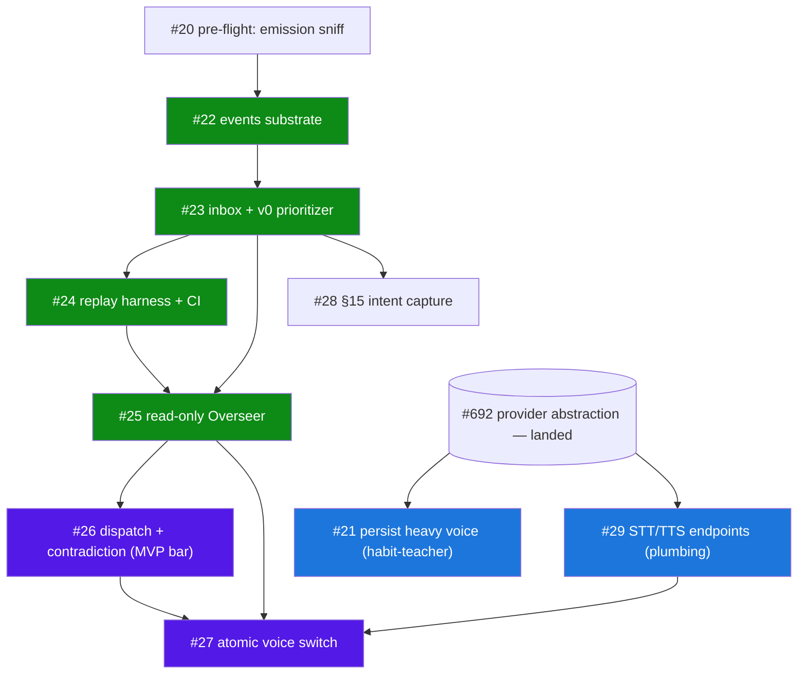
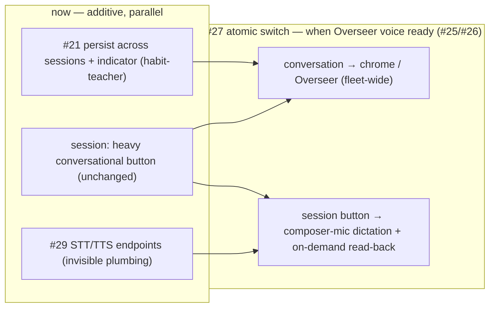
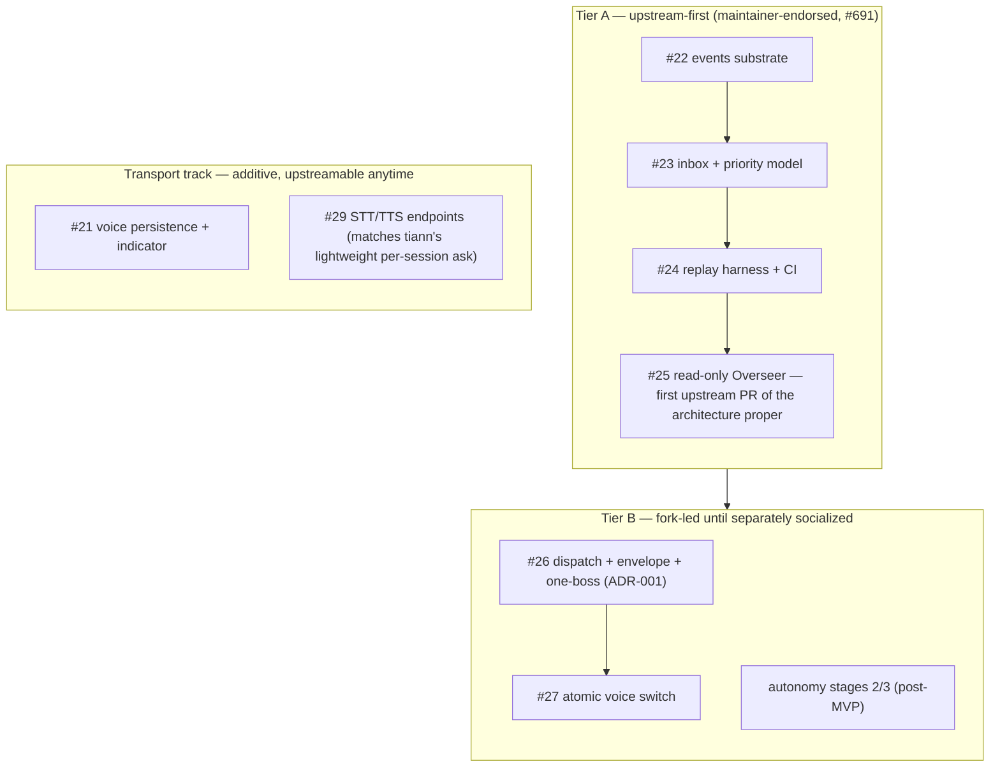

# Overseer — rollout shape and diagrams

> **Status:** fork-private rollout companion to the Rev 4 Overseer architecture docs. Captures the *delivery sequencing and upstream strategy* that evolved after the architecture was frozen — specifically the maintainer endorsement in `tiann/hapi` discussion #691 (2026-06-04) and the voice-layer reshaping decisions of 2026-06-05.
> **Date:** 2026-06-05
> **Scope:** the issue dependency graph (#19–#29), the voice-layer reshaping sequence, and the two-tier upstream rollout. Architecture substance is unchanged; this doc owns *order and strategy*, not design.
> **Leak discipline:** fork-private. Lives in `docs/plans/`, which never enters an upstream PR diff (leak scanner enforced). The two-tier rollout and issue-numbered DAGs below are fork-only. The sanitized architecture *shapes* (role/tier model, one-boss sequence, event→inbox promotion) may accompany an upstream design note in the maintainer's vocabulary; the strategy diagrams here may not.

> Companion docs (frozen Rev 4 architecture set — do not modify without lifting the freeze):
> - `2026-06-03-overseer-framing.md`, `2026-06-03-overseer-contracts.md`, `2026-06-03-overseer-prioritization.md`, `2026-06-03-overseer-build-sequence.md`
> - `docs/adr/0001-worker-facing-attribution-one-boss.md`

---

## Where this came from

The Rev 4 architecture set was sequenced defensively, before any maintainer signal. On 2026-06-04 the upstream maintainer (tiann) responded in discussion #691 and **endorsed the control-plane direction**: per-session voice should stay lightweight (STT to compose, TTS to read summaries), and "the more interesting direction is the control-plane layer above sessions: permission requests, blocked sessions, completions, and other attention events routed through one voice interface" — "matches HAPI's architecture better," with the landed provider abstraction (#692) named as "the right foundation."

That endorsement materially lowers the permanent-fork risk and lets the *substrate + read-only surface* travel upstream-first. The dispatch/one-boss/autonomy layer remains fork-led until separately socialized. This doc records the resulting delivery shape.

---

## 1. Build-sequence / issue dependency graph (#19–#29)

The trackable issue tree. Green = Tier-A (upstream-first, maintainer-endorsed). Purple = Tier-B (fork-led until socialized). Blue = parallel transport track (depends only on the landed provider abstraction, not the Overseer substrate).

Notes:

- **#20 → #22**: the emission-contract sniff calibrates how much the events substrate must lean on hub-observed synthesis vs. prompted emission. Kill-criterion: <~40% prompted compliance ⇒ rethink the primitive.
- **#21 is intentionally parallel** to the substrate — voice persistence is transport work that doesn't wait on events.
- **MVP acceptance bar is met when #26 lands.** #27 is post-MVP.
- **#28 (§15 intent capture)** absorbs the per-session scratchlist (#11) at fleet level *after* its v1 ships — not a supersede.

---

## 2. Voice-layer reshaping (now → atomic switch → after)

The settled answer to "voice belongs at the Overseer tier, not the worker tier." Everything additive happens now; the single destructive change (removing the per-session conversational button) fires only at the switch, when the Overseer has a conversational home — so there is never a conversation-less gap and never an interim "two ways to talk in a session."

Why this shape:

- The **heavy per-session conversational voice is kept** until the switch because it is the best available demonstration of "you can hold a conversation while doing other work" — the core habit the Overseer depends on. Ripping it out early would delete the teacher and leave the daily driver conversation-less.
- The persistence work in #21 is **not throwaway**: `voiceFocus: { kind: 'session' | 'overseer' | 'fleet' }` makes the switch a re-target (`session → overseer`), not a rewrite.
- **Provider capability is verified (2026-06-04)**: ElevenLabs (Scribe STT + TTS), Gemini (Cloud STT/Chirp + Gemini-TTS), Qwen/DashScope (Paraformer/Qwen3-ASR + CosyVoice) all expose standalone STT and TTS decoupled from their realtime layer. Endpoint *shapes* differ (e.g. Gemini STT = audio → `generateContent`), so #29 needs a per-backend capability shim. The "provider lacks a standalone endpoint" risk is theoretical for the current set.
- **Dictation never auto-sends.** A per-session message is an instruction a worker acts on; STT errors on code/jargon are high, so transcription fills the composer for review and the operator presses send (the ChatGPT dictate pattern).

### Why cross-session *conversation* is justified here (and absurd in a chat app)

A chat app has no "talk to all your threads at once" because threads are independent **topics** with no shared state — "conversations you must complete" is meaningless. HAPI work sessions are **things you must do**, each with a completion state, all serving one objective; "what needs me next?" is a real question across them. The aggregation target isn't the conversations — it's the **attention queue over work states** (the inbox). That is exactly what a chief-of-staff conversation arbitrates, which is why conversation belongs at the fleet/Overseer tier while the session keeps only speech transport.

---

## 3. Two-tier upstream rollout

What travels upstream first, what stays fork-led, and what is additive transport that can go upstream anytime.

Rationale:

- **Tier A** is precisely what tiann described — "attention events routed through one voice interface." #25 (read-only Overseer) is the natural first upstream PR of the architecture proper; #22/#23/#24 are pitched as its prerequisites.
- **Transport track** delivers the lightweight per-session voice the maintainer explicitly wants, with no dependency on the Overseer substrate.
- **Tier B** is the genuinely novel commitment the maintainer has not weighed in on — the Overseer dispatching back into worker sessions, operator-attribution-hiding (one-boss), and autonomy. Keep it fork-led; do not fold it into a Tier-A pitch.
- **Vocabulary**: upstream-facing artifacts lead with the maintainer's terms — "control-plane attention layer," "attention-event routing," "one voice interface" — and cite #691. Internal docs keep "Overseer."

---

## Architecture-shape diagrams (pending freeze lift)

These describe the system rather than the rollout and belong in the frozen Rev 4 docs, replacing existing ASCII art. They are upstream-safe (sanitized). Not embedded here to avoid duplicating canon; to be added to the architecture docs once the freeze is lifted:

- Role/tier model (Operator ↔ Overseer ↔ Workers ↔ event stream) — `flowchart` → framing doc
- Three-layer event → inbox promotion — `flowchart` → contracts doc
- Prioritization loop — cyclic `flowchart` → prioritization doc
- One-boss dispatch boundary (envelope never reaches the worker) — `sequenceDiagram` → ADR-001 / §13
- Edict/action lifecycle, inbox status transitions, worker state model — `stateDiagram-v2` → contracts §4 / §3 / §2
- Data model (events / event_links / inbox_items / dispatch_envelope / intent_items) — `erDiagram` → contracts doc
