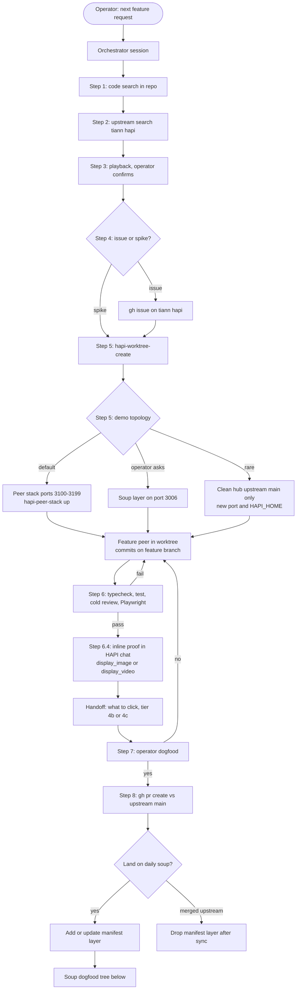
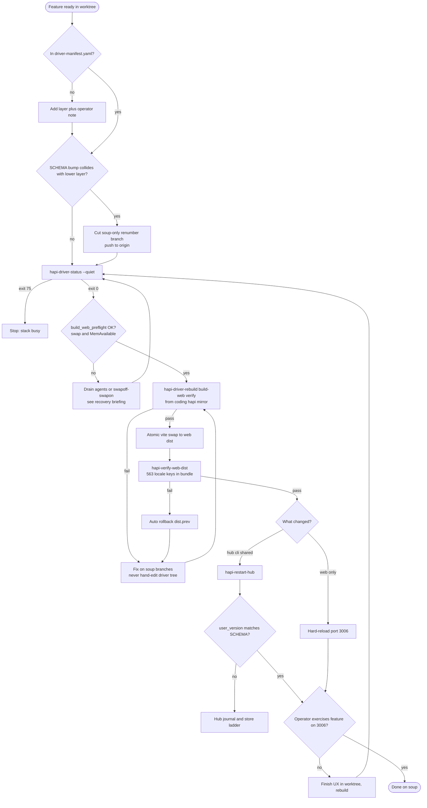

# Feature work lifecycle — single source of truth (heavygee/hapi fork)

**Last updated:** 2026-06-22  
**Audience:** Operator, orchestrators, feature peers — anyone doing local dev on this fork.

## Doc ownership — read this first

**This file is the only place that defines the workflow** (charts, done criteria, agent allow/forbid, soup vs peer stack vs stack swing). Every other doc must **link here** for workflow — not restate it.

| Topic | Sole doc (do not duplicate workflow elsewhere) |
|-------|------------------------------------------------|
| **Workflow** (this file) | Master + soup mermaid, topologies, permissions, ship/done |
| Intake step execution | [`new-feature-intake.md`](./new-feature-intake.md) — §0 handoff + steps 1–8 how-to only |
| Manifest, DB jiu-jitsu, `stack.lock`, atomic swap mechanics | [`driver-soup.md`](./driver-soup.md) |
| Peer stack / Playwright evidence | [`peer-stack.md`](./peer-stack.md) |
| Symlink + systemd paths | [`worktree-testing.md`](./worktree-testing.md) |
| `hapi-watch-activate-driver` script | [`watch-activate-driver.md`](./watch-activate-driver.md) |

**Supersedes:** any other doc (including `docs/plans/` briefings) that repeats soup dogfood steps or says `hapi-use-driver` is required when already on `~/coding/hapi/driver`.

---

## Live stack snapshot (2026-06-22)

- **Production dogfood URL:** `http://127.0.0.1:3006` (tailnet hostname in `~/.hapi/hub.env` — not for upstream issues)
- **`hapi-active`:** `~/coding/hapi/driver` → branch `driver/integration` @ **`969a7db5`**
- **Hub DB:** `~/.hapi/hapi.db` — **`PRAGMA user_version = 12`**
- **Web bundle:** `driver/web/dist/assets/index-B1HDpnQy.js` — **`hapi-verify-web-dist` OK** (563/563 `t()` keys)
- **Build meta:** `driver/web/dist/.hapi-build-meta.json` (`driverHead` matches driver HEAD)
- **Manifest:** `~/.config/hapi/driver-manifest.yaml` (operator-local; not in git)
- **Verify stamp:** `~/.hapi/driver-promotion.json` — proves typecheck+tests on driver HEAD; **does not** prove `web/dist` shipped (always run `hapi-verify-web-dist`)

**Recent pain (documented):** swap-full host killed vite ~5s into build; recovery = swap reset + full build + verify. See `local fork briefing under docs/plans/ (not pushed to GitHub)`.

---

## When you say "do the next feature" — master flow



Intake step numbers (handoff template, playback, gates): [`new-feature-intake.md`](./new-feature-intake.md) — **workflow lives here only**.

---

## Soup dogfood decision tree (production `:3006`)

Follow end-to-end. **Do not declare done at an intermediate box.**



---

## Stack path swing vs in-place restart

HAPI is **one monorepo** (`hub/`, `cli/`, `web/`, `shared/`). Hub and runner must stay on the **same tree**.

| Action | Moves `hapi-active`? | Restarts hub+runner? | Who |
|--------|----------------------|----------------------|-----|
| **`hapi-restart-hub`** | No | Yes (patient) | **Agent** — hub/cli/shared changed, already on driver soup |
| **`hapi-driver-rebuild --build-web`** | No | No | **Agent** — manifest merge + atomic `web/dist` |
| **`hapi-use-driver`** | Yes → driver | Yes (prompt) | **Operator** — stack path swing only |
| **`hapi-use-worktree`** | Yes → target | Yes (prompt) | **Operator** — PR worktree on `:3006`, etc. |

Stack switches **always prompt** (kill remote agent sessions). Non-interactive: `HAPI_STACK_SWITCH_YES=1` + operator TTY. **`hapi-use-driver` is not a substitute for `hapi-restart-hub`** when `readlink -f ~/coding/hapi-active` is already `~/coding/hapi/driver`.

Watch-activate: operator external shell only — [`watch-activate-driver.md`](./watch-activate-driver.md).

---

## Soup dogfood gates (promotion contract)

| Gate | When | Proves |
|------|------|--------|
| Compile pre-flight | rebuild, restart, stack switch | Tree parses; hub store loads |
| Verify stamp | optional `~/.hapi/driver-promotion.json` | typecheck + tests on driver HEAD — **not** that `web/dist` shipped |
| **`hapi-verify-web-dist`** | after every `--build-web` | Merged `web/src` strings in live `web/dist` |
| **`hapi-restart-hub`** | after hub/cli/shared rebuild | Live processes loaded new code |
| Operator proof | feature-specific | Works on `:3006` |

**Agent command sequence (already on driver soup):**

```bash
hapi-driver-status --quiet
hapi-driver-rebuild --build-web --verify
hapi-verify-web-dist
hapi-restart-hub                    # hub/cli/shared only
sqlite3 ~/.hapi/hapi.db 'PRAGMA user_version;'   # if schema bumped
# hard-reload browser
```

**Web-only:** rebuild/build-web + verify-web-dist + hard-reload — no hub restart.

Manifest format, atomic swap mechanics, DB jiu-jitsu: [`driver-soup.md`](./driver-soup.md) only.

---

## Ship / done semantics

| Stage | Meaning |
|-------|---------|
| **Ready for operator** | Peer gates passed; links + inline proof delivered |
| **Operator approved** | Explicit OK to open upstream PR |
| **Shipped upstream** | PR merged on `tiann/hapi` |
| **Done on soup (web-only)** | Manifest layer + rebuild/build-web + **`hapi-verify-web-dist` OK** + operator hard-reload |
| **Done on soup (hub/cli)** | Rebuild `--verify` + verify-web-dist (if web touched) + **`hapi-restart-hub`** + operator proof on `:3006` |

**Ship After Fix (fork):** when your branch is already in the manifest and you pushed **`web/` only**, `hapi-driver-rebuild --build-web` is part of done — not "wait for operator."

---

## Worktrees, branches, commits — who touches what

| Artifact | Where | Branch base | Commits go to | Never |
|----------|-------|-------------|---------------|-------|
| **Upstream PR work** | `~/coding/hapi/worktrees/<name>/` | `upstream/main` (+ optional `--after` merge train) | `feat/…` / `fix/…` on origin | PR from `driver/integration` |
| **Fork docs / tooling** | `~/coding/hapi/` mirror | `main` (fork) | `heavygee/hapi` main | In upstream PR diff |
| **Soup integration** | `~/coding/hapi/driver/` | `driver/integration` (rebuilt only) | **No hand commits** — manifest merge only | Agent `git commit` in driver |
| **Manifest** | `~/.config/hapi/driver-manifest.yaml` | n/a | Operator notes / fork docs | Committed secrets |

**Create worktree (canonical):**

```bash
hapi-worktree-create my-feature --branch feat/my-feature
# → ~/coding/hapi/worktrees/my-feature
```

**One feature → one worktree → one peer agent.** Handoff block required: [`new-feature-intake.md` §0](../tooling/new-feature-intake.md#0--feature-peer-agent--mandatory-handoff).

---

## Three demo topologies (operator picks at §5)

### 1. Peer stack — **default** for feature peers

- **Ports:** hub `3100–3199`, separate `HAPI_HOME` under `~/.hapi-peer/`
- **Safe for agents:** `hapi-peer-stack up|down|status|doctor` — **never** touches systemd or `:3006`
- **Proof:** Playwright on real `/sessions/:id` UI; PNG and/or MP4 under `localdocs/playwright-runs/` (gitignored)
- **Inline in HAPI chat:** `display_image` / `display_video` MCP, or `bun scripts/tooling/hapi-display-image.mjs <session-prefix> <absolute-path> [title]`
- **Done for peer:** gates pass + inline media in operator-readable session — **not** soup rebuild

### 2. Soup — daily driver on `:3006`

- **When:** operator wants feature in the **real** multi-layer stack, or after peer proof when promoting to production dogfood
- **Agent-safe:** `hapi-driver-rebuild --build-web [--verify]`, `hapi-driver-build-web`, `hapi-verify-web-dist`, **`hapi-restart-hub`** (hub/cli changes)
- **Agent-forbidden:** `hapi-use-driver`, `hapi-use-worktree`, `hapi-driver-rebuild --activate`, raw `sudo systemctl restart hapi-hub`
- **Web-only layer:** atomic `web/dist` swap + hard-reload — no hub restart
- **Hub/cli layer:** rebuild `--verify` + `hapi-restart-hub` + confirm `user_version`
- **Done on soup:** operator can use feature on `:3006` + verify-web-dist exit 0 — **not** verify stamp alone

### 3. Clean — upstream/main only (rare)

- Separate Proxmox/LAN hub, new port, isolated DB
- For upstream-parity review without fork soup layers
- Operator gets tailnet + LAN URLs in handoff

---

## Proof tiers (images and video)

Peers **must** assess tier before capture ([`peer-stack.md` § Evidence modality](../tooling/peer-stack.md#evidence-modality--agent-decides-png-vs-mp4)).

- **§6.4b PNG** — static existence (label, layout, copy, icon). Always for visible UI change.
- **§6.4c MP4/GIF** — interaction story (toggle, send, drawer, async feedback). 3–10s, annotated screencast preferred.
- **§6.4d Inline** — post into **HAPI web session chat** (not Cursor composer paths). Session needs `metadata.hapiMcpUrl` (ACP + MCP bridge, e.g. Cursor #956).
- **§8 PR** — upload same assets to GitHub PR description (`user-attachments/assets/…`); never commit binaries to branch.

**Tool names in HAPI agent sessions**

- MCP: `display_image`, `display_video` (when bridge present)
- CLI fallback: `hapi-display-image.mjs` (auto-routes video MIME to display_video when available)

---

## Commits and PRs — order of operations

1. **Implement** in worktree; conventional commits on feature branch
2. **Push** feature branch to `heavygee/hapi` (or fork remote)
3. **Peer gates** (§6) — all green before operator browser test
4. **Operator dogfood** (§7) — explicit approval
5. **Upstream PR** (§8) — `gh pr create` → `tiann/hapi` `main`, `Fixes #NNN`, cold review, post-push monitor
6. **Soup promotion** (optional / parallel) — manifest layer + rebuild tree above — **after** branch is merge-ready, not instead of peer proof

**Fork-only files never in upstream PR:** `docs/operator/`, `docs/plans/`, `CLAUDE.md`, `.cursor/`, operator tooling under `scripts/tooling/` unless upstreamable separately.

---

## Soup build: system vs web

| Layer touched | Rebuild command | Hub restart | Browser |
|---------------|-----------------|-------------|---------|
| `web/` only | `hapi-driver-build-web` or `rebuild --build-web` | No | Hard-reload |
| `hub/`, `cli/`, `shared/` | `hapi-driver-rebuild --build-web --verify` | **`hapi-restart-hub`** | Hard-reload if web also built |
| Manifest order / new layer | `hapi-driver-rebuild --build-web --verify` | If hub/cli changed | Hard-reload |

**Web/dist guarantee (2026-06-22):**

- Atomic swap via `dist.next` → `dist` (live never empty mid-build)
- Post-swap: `verify-soup-web-dist.mjs` — fail rolls back to `dist.prev`
- Audit anytime: `hapi-verify-web-dist`
- Memory preflight: refuses build when swap >85% or MemAvailable <2GiB

**Do not** run raw `bun run build` in `driver/web/` for production dogfood — bypasses atomic swap and preflight (recovery build 2026-06-22 was emergency only).

---

## Agent permission matrix (short)

**Allowed**

- Edit product code in `~/coding/hapi/worktrees/<name>/`
- `hapi-peer-stack up|down|status|doctor`
- `hapi-driver-status --quiet` → `hapi-driver-rebuild --build-web [--verify]`
- `hapi-driver-build-web`, `hapi-verify-web-dist`
- **`hapi-restart-hub`** when hub/cli changed and already on driver soup
- `hapi-driver-rollback-web` (web emergency)

**Forbidden**

- Hand-edit `~/coding/hapi/driver/`
- `hapi-use-worktree`, `hapi-use-driver`, `hapi-driver-rebuild --activate`
- `sudo systemctl restart/stop hapi-hub.service` (use `hapi-restart-hub`)
- `nohup bun run src/index.ts` from worktree on `:3006` / shared `~/.hapi/hapi.db`
- Declare done at verify stamp without `hapi-verify-web-dist` + operator `:3006` proof

---

## What you should expect on the next feature request

1. **Orchestrator** runs search + playback; you confirm scope.
2. **Peer** gets explicit handoff (completed vs owned steps).
3. **Worktree** appears under `~/coding/hapi/worktrees/<name>`.
4. **Default demo** is peer stack — you see PNG/MP4 **inline in HAPI chat** before touching `:3006`.
5. **If soup requested:** manifest layer → one rebuild owner → verify-web-dist → restart if needed → you hard-reload and click.
6. **After your approval:** upstream PR; soup layer stays until merged upstream or dropped from manifest.

**Friction mode — kill criteria**

- Peer stops at "tests pass" with no inline PNG/MP4 → reject handoff (§6.4d).
- Peer stops at verify stamp with verify-web-dist failing → dist still stale (2026-06-22 class bug).
- Peer runs `hapi-use-driver` without operator TTY → session massacre; use `hapi-restart-hub` instead when already on driver.
- Vite fails at ~5s → check `free -h` swap before blaming manifest.

---

## Outside the master mermaid (still local dev)

The intake mermaid is the **"operator requests next feature"** path. These cases are documented in linked files, not duplicated in the chart:

- **Mirror-only work** — fork docs, `scripts/tooling/`, `.cursor/` on `~/coding/hapi` `main` (no worktree, no soup rebuild)
- **Operator stack swing to a PR worktree on `:3006`** — `hapi-use-worktree` (no manifest layer); kills sessions; [worktree-testing.md](./worktree-testing.md)
- **Fork sync / branch hygiene** — `hapi-sync-fork-main`, `hapi-branch-audit`; [repo-layout-and-dev-flow.md](../operator/repo-layout-and-dev-flow.md)
- **Garden** — separate product repo proxying `:3006`; [driver-soup.md](./driver-soup.md)
- **Windows estate agents** — Teemo scope lock; [windows-estate-agents.md](../operator/windows-estate-agents.md)
- **PR review loop** — cold review, post-push monitor; [pr-review-loop.md](./pr-review-loop.md)

Historical **`docs/plans/`** peer briefings may contradict lifecycle until refreshed — see [DOC-SUPERSESSION.md](../plans/DOC-SUPERSESSION.md).

---

## Related documents (reference only — no workflow duplication)

- [`new-feature-intake.md`](./new-feature-intake.md) — §0 handoff + steps 1–8 execution
- [`driver-soup.md`](./driver-soup.md) — manifest, DB jiu-jitsu, locks, atomic swap
- [`peer-stack.md`](./peer-stack.md) — isolated stack commands
- [`DOC-SUPERSESSION.md`](../plans/DOC-SUPERSESSION.md) — stale plan briefings
- [`AGENTS.md`](../operator/AGENTS.md) — fork identity, upstream PR rules (not workflow)
