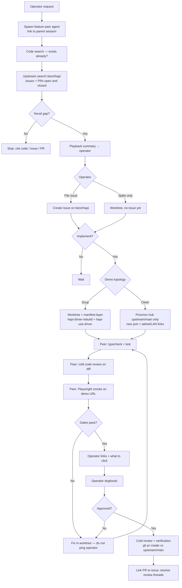

# New functionality intake

Canonical process when the operator asks for **new product behavior** (web, hub, cli, shared). Summarized in repo root [`AGENTS.md`](../../AGENTS.md).

**Orchestrator** (original session / tooling meta) owns steps 0-5 and demo topology. **Feature peer agent** owns implementation and pre-operator gates. **Upstream PR** happens only after operator dogfood approval.

---

## Flow



---

## Step-by-step

### 0 — Feature peer agent + mandatory handoff

When intake starts, spawn (or hand off to) a **dedicated feature peer**. The **orchestrator prompt is not optional** — it must list **which steps are already done** and **which steps the peer owns**.

Copy and fill this block (do not spawn a peer with only "implement X"):

```markdown
## Parent
- Orchestrator session: <cursor-session-id or HAPI session URL>
- Operator request: <verbatim>

## Intake status (orchestrator completed)
- [ ] 1 Code search — DONE: <paths or "none found">
- [ ] 2 Upstream search — DONE: <issue/PR links or "no match">
- [ ] 3 Playback — DONE: operator confirmed on <date>
- [ ] 4 Issue — <issue URL> OR spike-only (no issue yet)
- [ ] 5 Demo topology — <soup | clean> — <port/URL if already provisioned>

## Your assignment (feature peer)
- Own steps: **<e.g. 5 implementation + 6 gates + iterate until 7 handoff>**
- Do NOT redo: **<list completed step numbers>**
- Worktree: `~/coding/hapi-<name>` @ branch `<branch>` (create if missing)
- Do NOT edit `~/coding/hapi-driver` by hand
- Read: `docs/operator/AGENTS.md` + this file (`docs/tooling/new-feature-intake.md`)
- Before operator browser test: pass §6 (typecheck, test, cold review, Playwright)
- Report back to orchestrator with: demo URLs, screenshot path, test output, diff stat

## Links
- Issue: ...
- Playback summary: ...
```

One feature → one worktree → one peer. Do not share worktrees across agents.

---

## Where agents read instructions (not the daily driver)

Confusion is common: **`hapi-active` → `~/coding/hapi-driver` is the running hub/runner**, not where Cursor rules usually live.

| Source | Path | Applies when |
|--------|------|----------------|
| **Fork agent canon** | [`docs/operator/AGENTS.md`](../operator/AGENTS.md) | Workspace is `~/coding/hapi` (primary mirror). **Start here** on this fork. |
| **Intake playbook** | This file | New product behavior (steps 0-8). |
| **Tooling / soup** | [`driver-soup.md`](./driver-soup.md), [`README.md`](./README.md) | Manifest, rebuild, `hapi-use-driver`, worktrees. |
| **Operator local (gitignored)** | `~/coding/AGENTS.local.md`, optional `AGENTS.local.md` in repo | Machine voice, pre-PR checklist, worktree discipline. Never upstream. |
| **Global persona** | `~/coding/SOUL.md` | User-facing tone (never cite in PRs). |
| **Upstream-style root `AGENTS.md`** | Only on **`upstream/main`** / `tiann/hapi` | Not used on fork `main` (fork deletes or stubs it). Do not treat upstream root copy as fork canon. |
| **`cli/AGENTS.md`** | Package scope | Extra rules when the agent's focus is `cli/` only. |
| **Daily driver tree** | `~/coding/hapi-driver` | **Runtime / served UI** after `hapi-driver-rebuild` + `hapi-use-driver`. **Not** the default instruction root unless you explicitly open that folder as the IDE workspace. |

**Where to edit code**

| Goal | Edit in |
|------|---------|
| Upstream PR | `~/coding/hapi-<feature>` worktree, branch from `upstream/main` |
| Mirror / docs | `~/coding/hapi` (primary checkout) |
| Soup on `:3006` | Manifest merge only — `hapi-driver-rebuild`, never hand-edit driver |
| Try feature in browser | Whatever `readlink -f ~/coding/hapi-active` points at (usually driver after `hapi-use-driver`) |

**Peer agents** spawned from an orchestrator inherit **files on disk** in the workspace (`~/coding/hapi`), not the orchestrator's chat memory. They only know completed intake steps if the handoff block above says so.

### 1 — Code search (mandatory)

Search the repo for existing behavior, flags, routes, and UI:

- Ripgrep / semantic search on keywords from the request
- Read call sites, not just filenames
- **Stop with links** if the feature already exists or is partially implemented

### 2 — Upstream search (mandatory)

On `tiann/hapi`, search **open and closed** issues and PRs for the same theme:

```bash
gh search issues "scroll restoration" --repo tiann/hapi --state open
gh search issues "scroll restoration" --repo tiann/hapi --state closed
gh search prs "voice backend" --repo tiann/hapi --state open
gh search prs "voice backend" --repo tiann/hapi --state closed
```

Also check merged PRs that may have landed on `upstream/main` since the operator last synced.

### 3 — Playback (mandatory)

Before any implementation, send the operator a short **playback**:

- What you think they want
- What already exists (code + upstream links)
- Proposed gap / scope
- Risks or trade-offs (one paragraph max)

Wait for confirmation or correction.

### 4 — Issue vs worktree-first

Operator chooses:

| Choice | Action |
|--------|--------|
| **Open issue** | Create issue on `tiann/hapi` (use `gh api` + jq for bodies with backticks — see github-cli-safety skill) |
| **Spike first** | `hapi-worktree-create <name> --branch feat/...` from `upstream/main`; issue optional until dogfood passes |

Upstream PR branches stay **`upstream/main...HEAD`** for review. Soup manifest merge order is **local only** — see [driver-soup.md](./driver-soup.md).

### 5 — Demo topology (operator choice)

Ask explicitly: **soup** or **clean instance**?

#### Soup (daily driver)

- Implement in `~/coding/hapi-<name>`
- Add branch to `~/.config/hapi/driver-manifest.yaml`
- `hapi-driver-rebuild --build-web --verify`
- `hapi-use-driver` when ready (**restarts hub + runner on :3006; kills live sessions**)
- **Do not** run `hapi-watch-activate-driver` from this orchestrator/agent turn — it counts this session as WORKING until the turn ends ([watch-activate-driver.md](./watch-activate-driver.md)). Operator runs watch from an external shell, or `HAPI_STACK_SWITCH_YES=1 hapi-use-driver` when health shows WORKING=0.

Operator URL: existing tailnet hub (hostname in `~/.hapi/hub.env` / operator docs only — never in upstream issues) after swing.

#### Clean (upstream/main only)

Do **not** swing `hapi-active`. Stand up a **separate** hub on Proxmox (or LAN) from **`upstream/main` only** plus the feature branch:

| Component | When |
|-----------|------|
| **Hub** | Always — new `HAPI_LISTEN_PORT`, separate `HAPI_HOME` / DB if isolation needed |
| **Web** | Bundled in hub `web/dist` or vite proxy per operator setup |
| **Runner** | Only if the feature needs **remote spawn / live CLI sessions** — second runner must target the **new** hub URL, not `:3006` |

Give the operator **both**:

- Tailnet URL with deep path when possible (`/sessions/...`, `/settings`, etc.)
- LAN / Proxmox URL (`http://<host>:<port>/...`)

Document port, `HAPI_HOME`, and branch in the handoff message.

### 6 — Gates before operator test (mandatory)

**Do not** send "please try it" until all pass in the **demo worktree / instance**:

1. **`bun typecheck`** and **`bun run test`** (and `cd web && bun run test` if web touched)
2. **Cold code review** — full diff vs `upstream/main`; use [cold-pr-review-rubric.md](./cold-pr-review-rubric.md); fix Blocker/Major before handoff
3. **DB schema check** — if your branch bumps `SCHEMA_VERSION` in `hub/src/store/index.ts` (i.e. adds a `migrateFromVxToVy()` step), you MUST also add the reverse-SQL case to `apply_downgrade_step()` in [`scripts/tooling/hapi-driver-db-prep.sh`](../../scripts/tooling/hapi-driver-db-prep.sh). Without this, swinging `hapi-active` away from your layer later (back to upstream, or to a soup without it) aborts the activation cleanly but blocks until someone writes the SQL. See [driver-soup.md "DB schema jiu-jitsu"](./driver-soup.md#db-schema-jiu-jitsu-auto-handled-2026-06-01).
4. **Playwright smoke** — real browser, demo URL, auth token from operator env:

```bash
# Linux: bundled Chromium may hang; prefer system Chrome
export PLAYWRIGHT_CHROME_PATH=/usr/bin/google-chrome

node scripts/dev/read-hapi-web.mjs \
  "https://<demo-host>/sessions/<id>?token=<token>" \
  --expect "visible proof string" \
  --screenshot localdocs/playwright-runs/handoff.png \
  --timeout 30000
```

Assert: no `QuotaExceededError` / error-boundary strings in console; `failedRequests` empty unless documented.

Optional feature-specific repro scripts live under `scripts/dev/*-playwright.mjs`.

Only after (1)-(4): send operator **links**, **what to click**, and **screenshot path**.

### 7 — Operator dogfood

Operator validates in browser. Iterate in the worktree; re-run gates after each round. **Do not** open upstream PR until explicit approval.

### 8 — Upstream PR (after approval)

1. `/verification-before-completion` with command output
2. `/requesting-code-review` on `git diff upstream/main...HEAD`
3. `gh pr create` against `tiann/hapi` `main` — link issue (`Fixes #NNN`)
4. Post-push: [pr-review-loop.md](./pr-review-loop.md)

To land on daily soup after merge: drop layer from manifest if merged, or keep until upstream contains the commit; `hapi-driver-rebuild`.

---

## Ship / done semantics (HAPI)

For **new functionality intake**, "done" stages:

| Stage | Meaning |
|-------|---------|
| **Ready for operator** | Gates in §6 passed; links delivered |
| **Operator approved** | Explicit OK to open PR |
| **Shipped upstream** | PR merged on `tiann/hapi` |
| **On soup** | Manifest rebuilt + `hapi-use-driver` (operator choice) |

Global "Ship After Fix" applies to **production/tailnet daily driver** only after operator chooses soup activation — not before dogfood.

---

## Related

- [driver-soup.md](./driver-soup.md) — manifest, rebuild, read-only driver tree
- [worktree-testing.md](./worktree-testing.md) — `hapi-use-worktree`, env symlinks
- [pr-review-loop.md](./pr-review-loop.md) — pre-PR and post-push discipline
- [README.md](./README.md) — meta bot charter
