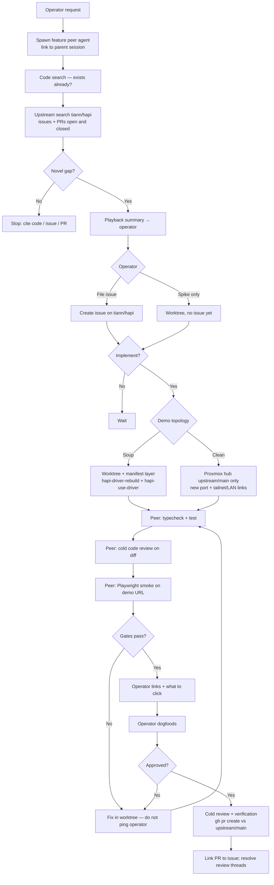

# New functionality intake

Canonical process when the operator asks for **new product behavior** (web, hub, cli, shared). Summarized in repo root [`AGENTS.md`](../../AGENTS.md).

**Orchestrator** (original session / tooling meta) owns steps 0-5 and demo topology. **Feature peer agent** owns implementation and pre-operator gates. **Upstream PR** happens only after operator dogfood approval.

---

## Flow



---

## Step-by-step

### 0 — Feature peer agent

When intake starts, spawn (or hand off to) a **dedicated feature peer** that:

- Records the **parent session id** and operator request verbatim
- Does not edit `~/coding/hapi-driver` by hand
- Reports back to the orchestrator with evidence (search results, demo URL, test output)

One feature → one worktree → one peer. Do not share worktrees across agents.

### 1 — Code search (mandatory)

Search the repo for existing behavior, flags, routes, and UI:

- Ripgrep / semantic search on keywords from the request
- Read call sites, not just filenames
- **Stop with links** if the feature already exists or is partially implemented

### 2 — Upstream search (mandatory)

On `tiann/hapi`, search **open and closed** issues and PRs for the same theme:

```bash
gh search issues "scroll restoration" --repo tiann/hapi --state open
gh search issues "scroll restoration" --repo tiann/hapi --state closed
gh search prs "voice backend" --repo tiann/hapi --state open
gh search prs "voice backend" --repo tiann/hapi --state closed
```

Also check merged PRs that may have landed on `upstream/main` since the operator last synced.

### 3 — Playback (mandatory)

Before any implementation, send the operator a short **playback**:

- What you think they want
- What already exists (code + upstream links)
- Proposed gap / scope
- Risks or trade-offs (one paragraph max)

Wait for confirmation or correction.

### 4 — Issue vs worktree-first

Operator chooses:

| Choice | Action |
|--------|--------|
| **Open issue** | Create issue on `tiann/hapi` (use `gh api` + jq for bodies with backticks — see github-cli-safety skill) |
| **Spike first** | `hapi-worktree-create <name> --branch feat/...` from `upstream/main`; issue optional until dogfood passes |

Upstream PR branches stay **`upstream/main...HEAD`** for review. Soup manifest merge order is **local only** — see [driver-soup.md](./driver-soup.md).

### 5 — Demo topology (operator choice)

Ask explicitly: **soup** or **clean instance**?

#### Soup (daily driver)

- Implement in `~/coding/hapi-<name>`
- Add branch to `~/.config/hapi/driver-manifest.yaml`
- `hapi-driver-rebuild --build-web --verify`
- `hapi-use-driver` when ready (**restarts hub + runner on :3006; kills live sessions**)

Operator URL: existing tailnet hub (e.g. `https://hapi.tail9944ee.ts.net`) after swing.

#### Clean (upstream/main only)

Do **not** swing `hapi-active`. Stand up a **separate** hub on Proxmox (or LAN) from **`upstream/main` only** plus the feature branch:

| Component | When |
|-----------|------|
| **Hub** | Always — new `HAPI_LISTEN_PORT`, separate `HAPI_HOME` / DB if isolation needed |
| **Web** | Bundled in hub `web/dist` or vite proxy per operator setup |
| **Runner** | Only if the feature needs **remote spawn / live CLI sessions** — second runner must target the **new** hub URL, not `:3006` |

Give the operator **both**:

- Tailnet URL with deep path when possible (`/sessions/...`, `/settings`, etc.)
- LAN / Proxmox URL (`http://<host>:<port>/...`)

Document port, `HAPI_HOME`, and branch in the handoff message.

### 6 — Gates before operator test (mandatory)

**Do not** send "please try it" until all pass in the **demo worktree / instance**:

1. **`bun typecheck`** and **`bun run test`** (and `cd web && bun run test` if web touched)
2. **Cold code review** — full diff vs `upstream/main`; use [cold-pr-review-rubric.md](./cold-pr-review-rubric.md); fix Blocker/Major before handoff
3. **Playwright smoke** — real browser, demo URL, auth token from operator env:

```bash
# Linux: bundled Chromium may hang; prefer system Chrome
export PLAYWRIGHT_CHROME_PATH=/usr/bin/google-chrome

node scripts/dev/read-hapi-web.mjs \
  "https://<demo-host>/sessions/<id>?token=<token>" \
  --expect "visible proof string" \
  --screenshot localdocs/playwright-runs/handoff.png \
  --timeout 30000
```

Assert: no `QuotaExceededError` / error-boundary strings in console; `failedRequests` empty unless documented.

Optional feature-specific repro scripts live under `scripts/dev/*-playwright.mjs`.

Only after (1)-(3): send operator **links**, **what to click**, and **screenshot path**.

### 7 — Operator dogfood

Operator validates in browser. Iterate in the worktree; re-run gates after each round. **Do not** open upstream PR until explicit approval.

### 8 — Upstream PR (after approval)

1. `/verification-before-completion` with command output
2. `/requesting-code-review` on `git diff upstream/main...HEAD`
3. `gh pr create` against `tiann/hapi` `main` — link issue (`Fixes #NNN`)
4. Post-push: [pr-review-loop.md](./pr-review-loop.md)

To land on daily soup after merge: drop layer from manifest if merged, or keep until upstream contains the commit; `hapi-driver-rebuild`.

---

## Ship / done semantics (HAPI)

For **new functionality intake**, "done" stages:

| Stage | Meaning |
|-------|---------|
| **Ready for operator** | Gates in §6 passed; links delivered |
| **Operator approved** | Explicit OK to open PR |
| **Shipped upstream** | PR merged on `tiann/hapi` |
| **On soup** | Manifest rebuilt + `hapi-use-driver` (operator choice) |

Global "Ship After Fix" applies to **production/tailnet daily driver** only after operator chooses soup activation — not before dogfood.

---

## Related

- [driver-soup.md](./driver-soup.md) — manifest, rebuild, read-only driver tree
- [worktree-testing.md](./worktree-testing.md) — `hapi-use-worktree`, env symlinks
- [pr-review-loop.md](./pr-review-loop.md) — pre-PR and post-push discipline
- [README.md](./README.md) — meta bot charter
